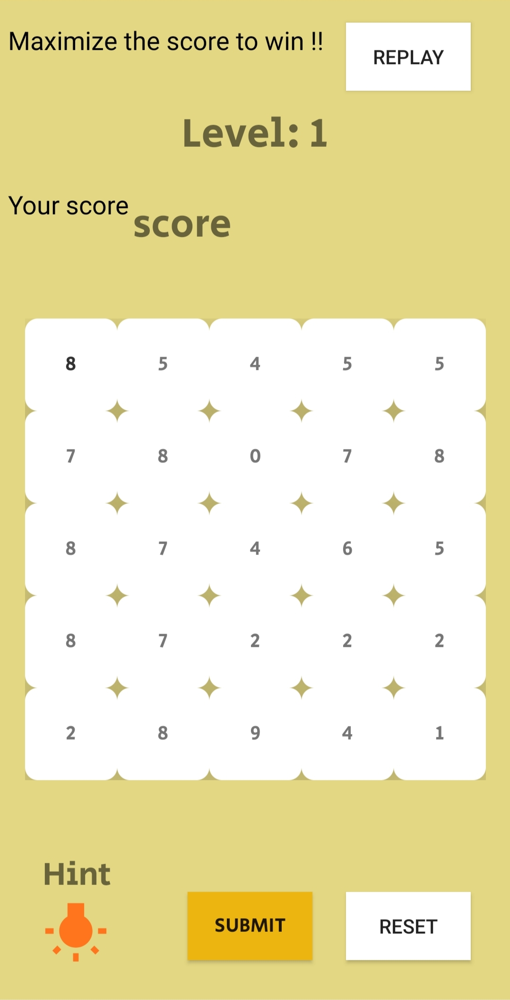
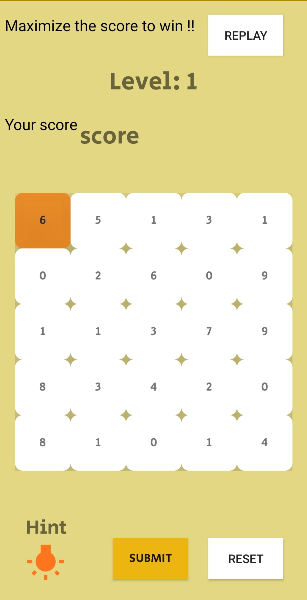
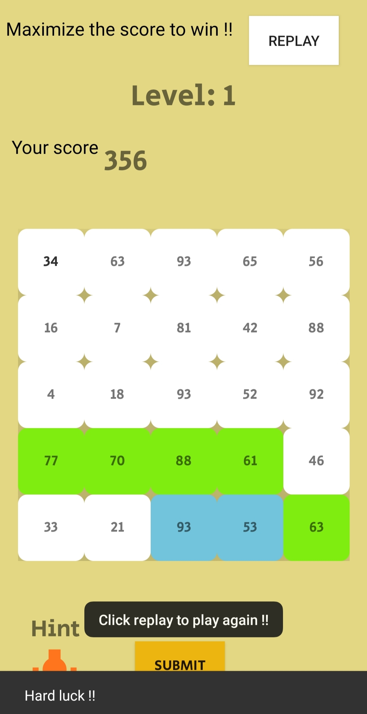

# Recxa puzzle

App is a game based on a standard "Dynamic programming" problem 'Gold mine'. The users needs to maximize the score under the given constraint. The app gives a proper warning for any invalid selection.User can get hint, reset the selection at any moment. The range of number increases at each level.
<i float = "left">
  

</i>
  
From current cell it's valid to **go right** or to **downward diagonally**
  

